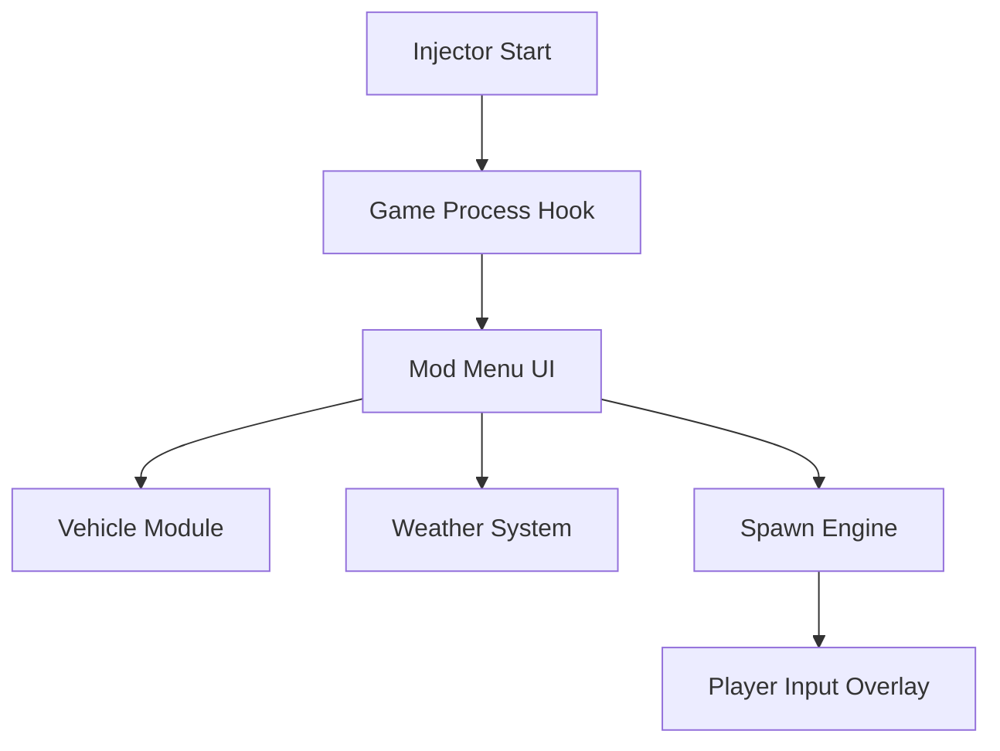

# RV There Yet? Mod Menu – Expand Your Roadtrip Adventure 🚐

Hit the highway with full control using the **RV There Yet? Mod Menu** — a fully featured customization suite that gives you creative power over vehicles, weather, travel mechanics, and NPC interactions. Designed for *RV There Yet?* players who want to explore every inch of the map without limits, this tool turns your road trip into a sandbox of freedom.

Fine-tune your RV performance, teleport across states, or spawn scenic events in real time — all through a clean, toggle-based interface.

---

## 🧭 Overview

The **RV There Yet? Mod Menu** brings full control to your travel simulator. It injects directly into the runtime process via a secure, low-latency API, allowing players to activate commands and edit variables live — no save editing or restart required.

Enjoy creative freedom without compromising immersion, whether you’re optimizing your camper’s handling, changing weather patterns, or spawning rare encounters.

> [!NOTE]
> All modifications are *client-side only* and will not affect multiplayer stability or saved progress integrity.

---

## ⚙️ Key Features

### 🚗 Vehicle Enhancements

* Adjust top speed, torque, and suspension stiffness
* Enable no-fuel or infinite durability mode
* Instant tire repair & refuel shortcut (`F2`)
* Toggle traction assist and RV stability controls

### 🌤 Environmental Controls

* Change weather dynamically: sunny, stormy, fog, dusk
* Time acceleration toggle (1x–10x)
* Region climate lock (keep one weather zone active)
* Force day/night cycle resets

### 🧭 Teleport & Navigation

* Click-map teleportation with minimap integration
* Save up to 10 custom waypoint sets
* "Quick Hop" feature for short-range repositioning
* Coordinates input command support

### 🧩 Object & NPC Spawner

* Spawn random travelers, animals, or roadside objects
* Vehicle duplication for convoy mode
* Edit object scale and rotation
* Delete unwanted map clutter

### 💾 Custom Presets

* Save entire setups as `.modcfg` files
* Auto-load preferred preset on startup
* Import/export shared mod configs from community

---

## 🪟 Compatibility

| Platform             | Supported | Notes                                 |
| -------------------- | --------- | ------------------------------------- |
| **Windows 10 / 11**  | ✅         | Full support, both DX11 & DX12 builds |
| **Steam Release**    | ✅         | Stable on latest update               |
| **Game Pass / Epic** | ⚙️        | Partial – manual path input required  |
| **Controllers**      | ✅         | Menu accessible via gamepad overlay   |

> [!IMPORTANT]
> Always launch the game first, then inject the mod menu — this ensures memory mapping aligns correctly with the latest patch.

---

## ⚡ Quick Setup

1. **Extract** `RVModMenu.zip` to a clean directory.
2. **Run** `rv_injector.exe` as Administrator.
3. Select your **game build** (Steam, Epic, or Local).
4. Click **Inject** — wait for confirmation beep.
5. Press `Insert` to open the in-game menu.

Example command-line startup:

```bash
rvmod.exe --teleport=on --weather=clear --speed=2.0
```

To save your setup:

```bash
rvmod.exe --save-config="roadtrip_plus.modcfg"
```

---

## 🧩 System Flow Diagram



---

## 🔧 Advanced Config Options

| Parameter       | Function                     | Range   | Default   |
| --------------- | ---------------------------- | ------- | --------- |
| `max_speed`     | Vehicle top speed multiplier | 0.5–5.0 | 1.5       |
| `fuel_usage`    | Fuel consumption rate        | 0–100   | 25        |
| `weather_mode`  | Weather type index           | 0–5     | 0 (Sunny) |
| `time_speed`    | Day/night cycle rate         | 1–10    | 1         |
| `spawn_density` | Object spawn frequency       | 1–10    | 4         |

> [!TIP]
> Try pairing a 2x time rate with fog weather for cinematic night drives.

---

## ❓ FAQ

**Q1: Is the mod menu safe to use online?**
Yes. It runs client-side only — no server packet interference or sync modification.

**Q2: Can I use this with other trainers or reshade mods?**
Yes, as long as they don’t overwrite the same DLL injection point.

**Q3: Does it support hotkey remapping?**
Absolutely. Every action can be rebound in `hotkeys.ini`.

**Q4: Can I spawn rare map objects?**
Yes — you can generate any registered entity from the internal database.

**Q5: Will this affect my save files?**
No. All effects are temporary and reset on restart unless saved manually.

---

## 🧭 Example Presets

**Chill Roadtrip (Cinematic Mode)**

```cfg
weather_mode=1  
time_speed=2  
max_speed=1.2  
fuel_usage=10  
spawn_density=3
```

**Mad Max Convoy (Chaos Mode)**

```cfg
weather_mode=4  
time_speed=6  
max_speed=4.0  
spawn_density=9  
fuel_usage=0
```

---

## 🚀 Final Thoughts

With the **RV There Yet? Mod Menu**, the open road becomes your playground. From photorealistic drives to chaotic convoy experiments, this menu lets you rewrite every aspect of your adventure.

Drive free. Modify everything.
**Your road trip, your rules.**

---
